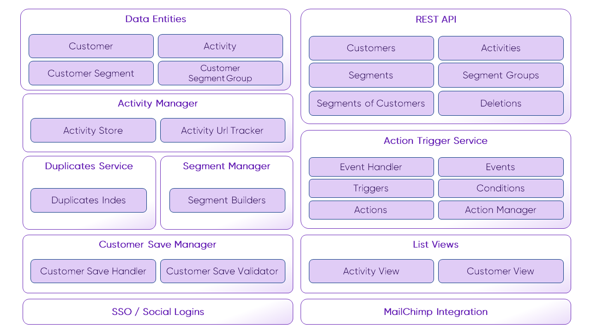

# Architecture Overview

The following architecture overview shows available framework components. The component configuration takes place in the 
`pimcore_customer_management_framework` configuration node. Optionally for each component a custom implementation can be 
configured and used.

For Details for the components see additional documentation pages like: 

* Data Entities for [Customer](./05_Working-with-Customers.md) and [Customer Segments](./11_CustomerSegments.md)
* [Activity Manager](./09_Activities/README.md)
* [Customer Duplicates Service](./15_CustomerDuplicatesService.md)
* [Segment Manager](./11_CustomerSegments.md)
* [Customer Save Manager](./06_CustomerSaveManager.md)
* [Rest API Webservice](./26_Webservice.md)
* [Action Trigger Service](./22_ActionTrigger.md)
* [List Views](./28_ListViews.md)
* [Integration with Pimcore Personalization](./30_Personalization/README.md)
* [MailChimp Integration](./24_NewsletterSync/README.md)
