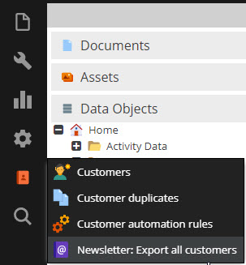

# Installation and First Configuration

This section describes the installation of the Customer Management Framework and the first steps of configuration.

## Installation

1) Add dependency for CMF to your composer.json and run composer update. 
```json
    ...
    "require": {
        ...
        "pimcore/customer-management-framework-bundle": "^1",
        ...
   }
   ... 
```

2) Open Pimcore Admin UI, navigate to `Tools` > `Extensions` and activate and install 
`PimcoreCustomerManagementFrameworkBundle` and `ObjectMergerBundle`. 


The installer does following tasks:
* Install several data object classes.
* Create additional tables for activities, deletions, segment building, actions, triggers, rules, duplicates and
  newsletter system export.   
* Add additional permissions.

After successful installation and reload of Pimcore Admin UI an additional customer management menu should be available. 


