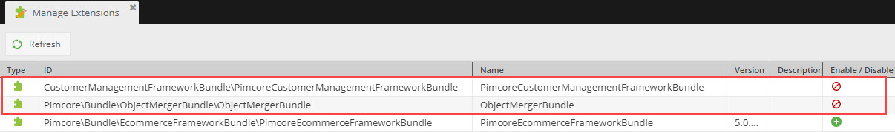

# Installation and First Configuration

This section describes the installation of the Customer Management Framework and the first steps of configuration.

> Please note that Customer Management Framework requires MariaDB as database. I currently will not work with default MySQL. 

## Installation

1) Add dependency for CMF to your composer.json and run composer update. 
```json
    ...
    "require": {
        ...
        "pimcore/customer-management-framework-bundle": "^1",
        ...
   }
   ... 
```

2) Open Pimcore Admin UI, navigate to `Tools` > `Extensions` and activate and install 
`PimcoreCustomerManagementFrameworkBundle` and `ObjectMergerBundle`. 



The installer does following tasks:
* Install several data object classes.
* Create additional tables for activities, deletions, segment building, actions, triggers, rules, duplicates and
  newsletter system export.   
* Add additional permissions.

After successful installation and reload of Pimcore Admin UI an additional customer management menu should be available. 


## Configure Customer Class

The CMF installation does not create a data object class for customers. That is because the framework does not limit you
on specific classes or class structures when it comes to customers. The only requirement is that the customer class 
has to be 'prepared' to be used in CMF context. 

Following options to prepare the customer class are available:
 
* For all basic CMF functionality: The customer class needs to extend the 
  [`CustomerManagementFrameworkBundle\Model\AbstractCustomer`](https://github.com/pimcore/customer-data-framework/blob/master/src/Model/AbstractCustomer.php) 
  class. In addition to that, following data attributes need to be available in the customer class:
  * `active`: checkbox
  * `gender`: gender field
  * `firstname`: firstname field
  * `lastname`: lastname field
  * `street`: input field
  * `zip`: input field
  * `city`: input field
  * `countryCode`: country selection
  * `email`: email field
  * `phone`: input field
  * `manualSegments`: objects relation to `CustomerSegments` or objects with metadata to `CustomerSegments` with 
     `created_timestamp` and `application_counter` as numeric meta fields
  * `calculatedSegments`: objects relation to `CustomerSegments` or objects with metadata to `CustomerSegments` with 
     `created_timestamp` and `application_counter` as numeric meta fields
  * `idEncoded`: input field
  
  As starting point this [class definition](https://github.com/pimcore/customer-data-framework/blob/master/install/class_source/optional/class_Customer_export.json) can be used. 
 
 
* When using customer objects as users for Symfony security: In this case the customer class needs to extend the 
  [`CustomerManagementFrameworkBundle\Model\AbstractCustomer\DefaultAbstractUserawareCustomer`](https://github.com/pimcore/customer-data-framework/blob/master/src/Model/AbstractCustomer/DefaultAbstractUserawareCustomer.php) 
  class and also need to have one additional data attribute:
  * `password`: password field
 
* When using the provided [SSO functionality](./Single_Sign_On.md): In this case the customer class additionally needs
  to implement the [`CustomerManagementFrameworkBundle\Model\SsoAwareCustomerInterface`](https://github.com/pimcore/customer-data-framework/blob/master/src/Model/SsoAwareCustomerInterface.php)
  interface and also need to have one additional data attribute:   
  * `ssoIdentities`: objects relation to `SsoIdentity`
 
 
* Minimal Requirements (not suggested): If you want to be complete independent from any base classes, you just need to 
  make sure the customer class somehow implements the interface `CustomerManagementFrameworkBundle\Model\CustomerInterface`

> It is recommended to use `Customer` as name for the customer class. But it is also possible to use any other name. 
> In this case, the configuration `general.customerPimcoreClass` for the customer class name has to be adapted. For details
> see [Configuration chapter](./03_Configuration.md). 
      
Of course your customer class can have additional attributes as needed.
   

## Configuration

The CMF ships with an default configuration for basic functionality. To start up, no additional configuration should be 
needed. To activate additional or customize existing functionality, please have a look at the 
[configuration chapter](03_Configuration.md).  

## Setting Up necessary cron jobs
There are several cron jobs needed by the CMF. These need to be configured and setup based on the solution requirements. 
See [CronJob Docs](./04_Cronjobs.md) for details. 


## (Optional) Prerequisites for SSO

If SSO functionality of CMF should be integrated, please follow the steps for [Integration of Single Sign On](./18_Single_Sign_On.md). 

