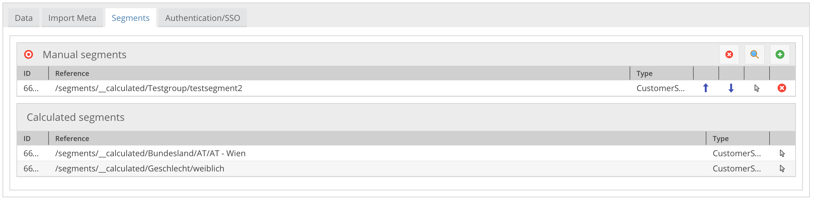
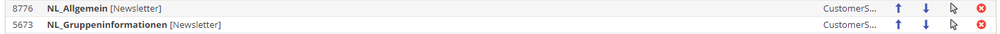

# Customer Segments

*Customer segmentation is the practice of dividing a customer base into groups of individuals that are similar in specific 
ways relevant to marketing, such as age, gender, interests and spending habits.*

The customer management framework includes tools for creating and managing customer segments and segment groups. 
`CustomerSegments` and `CustomerSegmentGroups` are regular Pimcore objects that are assigned via relations to customer objects.


## Manual vs. calculated segments

The customer object contains two separate object relation fields for manual and calculated segments. Manual segments are 
added within the Pimcore backend UI by drag and drop. Calculated segments could be added by the CMF within the segment building 
process.



#### Optional: use path formatter for an alternative version of displaying the related customer segments:


Just add `CustomerManagementFrameworkBundle\PathFormatter` as formatter class to customer segment relation fields in the Pimcore class editor if you prefer this segment relation presentation.

## SegmentManager

The SegmentManager is responsible for managing, creating and reading `CustomerSegments` and `CustomerSegmentGroups` within 
the CMF. Take a look at the [`SegmentManagerInterface`](https://github.com/pimcore/customer-data-framework/blob/master/src/SegmentManager/SegmentManagerInterface.php) 
for additional inline PHP docs for each implemented method.

The SegmentManager is registered as `CustomerManagementFrameworkBundle\SegmentManager\SegmentManagerInterface` on the container. 
An integral part of the SegmentManager are SegmentBuilders which do the actual work of calculating segments for a customer. 

### SegmentBuilders

Segment builders are PHP classes which need to implement the 
[`SegmentBuilderInterface`](https://github.com/pimcore/customer-data-framework/blob/master/src/SegmentBuilder/SegmentBuilderInterface.php). 
They could be used to create automatically calculated segments based on the customer data. For example it would be possible 
to create a SegmentBuilder "Age" which divides customers into segments of age groups depending on a birthday field.

#### Execute on Customer Save vs. Async

SegmentBuilders can be implemented to be either executed directly on customer save or to be executed asynchronously via a cron job. 
Take a look at the `executeOnCustomerSave()` method of the `SegmentBuilderInterface`. If this returns true it's executed 
directly on customer save, otherwise each customer change is added to a queue and later on, the segment building process 
will be done by a cron job.
 
In the `SegmentManagerInterface` there is a method `addCustomerToChangesQueue()` which could be used to trigger customer 
changes. This needs to be done every time a customer/SegmentBuilder related data record gets changed. By default this is 
done on customer object save and also when a new customer activity is tracked.
If there are any other events in your implementation that should trigger segment building (e.g. changes in objects that 
are related to a customer), this method has to be called manually. 


#### Create your own SegmentBuilder

As mentioned above they need to implement the `SegmentBuilderInterface`. Most of the work is done in the 
`prepare(SegmentManagerInterface $segmentManager)` and 
`calculateSegments(CustomerInterface $customer, SegmentManagerInterface $segmentManager)` methods.

- `prepare()` is called when a SegmentBuilder gets prepared. Later on it will be executed with `calculateSegments`. So 
  add in `prepare()` code that needs to be done once for all customers (for example some initializations etc.).

- `calculateSegments()` then does the actual work: it calculates the segment for the given customer and adds/removes the 
  calculated segments according to the implemented logic.

Both of the methods could interact with the SegmentManager for creating segments and adding/removing them to the customer.

###### SegmentManager sample calls:
```php
<?php 
/* Create a segment called "male" within the segment group "gender". The segment group "gender" will be created too if 
   it doesn't exist.
   If the segment already exists it will not be reacreated but the existing segment will be returned.
*/
$segment = $segmentManager->createCalculatedSegment("male", "gender");

// Get all other segments of the segment group "gender" (but exclude "male")
$deleteSegments = $segmentManager->getSegmentsFromSegmentGroup($segment->getGroup(),[$segment]);

// Add the segment to the customer and remove all other segments from the segment group "gender").
// The param "GenderSegmentBuilder" is an optional comment which will be added to the notes/events tab of the customer.
$addSegments = [$segment];
$segmentManager->mergeSegments($customer, $addSegments, $deleteSegments, "GenderSegmentBuilder");
$segmentManager->saveMergedSegments($customer);
```

##### Optional: Store the Creation Date and How Often a Segment was Added

The CMF offers a mechanism to handle potentially expiring segments by storing the creation date and a counter how often
 a segment was added if it applies multiple times. For example, if there is a segment "interested in hiking", it might 
 be important that it will expire or have to be removed at some point in the future. Also a counter could be useful to store the 
 information on how often a customer performed an activity which led to the segment "interested in hiking".


The CMF supports objects and objects with metadata fields to store the manual and calculated segment relations of a customer.
If you would like to use the creation date + counter storing feature, it's necessary to use at least for the 
`calculatedSegments` attribute an object with metadata field with the following two metadata columns:
- `created_timestamp` (type `number`)
- `application_counter` (type `number`)

**SegmentManager sample calls with usage of the timestamp + counter storage features (take a look at the PHPdoc of the 
`SegmentManagerInterface` for more details):**
```php
<?php 
// Example last hiking/climbing activity timestamps (int values) calculated based on "hiking/climbing interest" activity data
$lastHikingActivityTimestamp;
$lastClimbingActivityTimestamp;

$hikingSegment = $segmentManager->createCalculatedSegment("interests", "hiking");
$climbingSegment = $segmentManager->createCalculatedSegment("interests", "climbing");

/*
   Add the 2 segments with the given timestamps and let the counter increment automatically each time the timestamp changes.
   The timestamp will be applied to all added segments in one mergeSegments call.
   Therefore in this case 2 merge segment calls are needed as $hikingSegment and $climbingSegment should have different timestamps.
*/
$segmentManager->mergeSegments($customer, [$hikingSegment], [], "InterestSegmentBuilder", $lastHikingActivityTimestamp, true);
$segmentManager->mergeSegments($customer, [$climbingSegment], [], "InterestSegmentBuilder", $lastClimbingActivityTimestamp, true);
$segmentManager->saveMergedSegments($customer);

// The same example like above but manually determine the counter (based on activity data)
$hikingActivityCounter = 12;
$climbingActivityCounter = 3;

$segmentManager->mergeSegments($customer, [$hikingSegment], [], "InterestSegmentBuilder", $lastHikingActivityTimestamp, $hikingActivityCounter);
$segmentManager->mergeSegments($customer, [$climbingSegment], [], "InterestSegmentBuilder", $lastClimbingActivityTimestamp, $climbingActivityCounter);
$segmentManager->saveMergedSegments($customer);

```

###### Extract segment application counter of customers
```php
<?php
// get all segment application counters of a customer
$all = $segmentManager->getSegmentExtractor()->getAllSegmentApplicationCounters($customer);
/*
example result (segmentId => application counter)
[
    6692709 => 1,
    6694297 => 1,
    6697153=>  2
]
*/

// get segment application counter of a given segment
$count = $segmentManager->getSegmentExtractor()->getSegmentApplicationCounter($customer, $segment);
```

#### Registration of Segment Builders

Segment builders need to be configured as services in the symfony service container. All segment builders which are 
registered as services with the tag `cmf.segment_builder` will be executed during segment building process. 
 
###### Example service definitions
```yaml
services:
    appbundle.cmf.segment_builder.state:
        class: CustomerManagementFrameworkBundle\SegmentBuilder\StateSegmentBuilder
        tags: [cmf.segment_builder]
        
        
    appbundle.cmf.segment_builder.gender:
       class: CustomerManagementFrameworkBundle\SegmentBuilder\GenderSegmentBuilder
       arguments:
          - 'Gender'
          - 'male'
          - 'female'
          - 'gender unknown'
    
       tags: [cmf.segment_builder]
```


#### Built-in Segment Builders

The CMF framework includes some SegmentBuilders which can be used out of the box:
 
##### AgeSegmentBuilder

Calculates age range segments based on a birthday field. 

| configuration option  | description                                                                                                                             |
| ----------------------|-----------------------------------------------------------------------------------------------------------------------------------------|
| segmentGroup          | name of the segment group                                                                                                               |
| birthDayField         | name of the birthday field in the customer object                                                                                       |
| ageGroups             | array of arrays to define the used age groups. Example: [[0,50],[51,100]] would result in an age group 0-50 and another one with 51-100 |


##### GenderSegmentBuilder

Calculates segments based on the gender field. 

| configuration option  | description                                                                                                                             |
| ----------------------|-----------------------------------------------------------------------------------------------------------------------------------------|
| segmentGroup          | name of the segment group                                                                                                               |
| maleSegmentName       | name of the male segment                                                                                                                |
| femaleSegmentName     | name of the female segment                                                                                                              |
| notsetSegmentName     | name of the segment if the gender of the customer is not male or female                                                                 |


##### StateSegmentBuilder

Calculates state segments based on the zip field and zip ranges for each state. It currently works for AT, DE and CH 

| configuration option  | description                                                                                                                                                         |
| ----------------------|---------------------------------------------------------------------------------------------------------------------------------------------------------------------|
| segmentGroup          | name of the segment group                                                                                                                                           |
| countryTransformers   | define the data transformers which should be used for each country - the data transformer is responsible to convert the zip to a state based on it's implementation |


## Console commands
Following console commands are available for segment building process. 

##### Build Segments for Customers in the Changes Queue
This should be executed on regular basis, see also [CronJobs](04_Cronjobs.md): 
```
php pimcore/cli/console.php cmf:build-segments
```

##### Build Segments for all Customers: 
```
php pimcore/cli/console.php cmf:build-segments -f
```

##### Build Segment x for all Customers (provide Symfony Service id of SegmentBuilder): 
```
php pimcore/cli/console.php cmf:build-segments --segmentBuilder='appbundle.cmf.segment_builder.state'
```


## Segment Assignment to Pimcore Elements
In addition to customers, it is also possible to assign segments to other Pimcore elements. So, elements like documents
can be tagged with segments. That information can be used later on for several use cases, e.g. tracking activities like
user xy has visited several pages that are tagged with a certain segment. For details see 
[Assign Segment Chapter](./12_SegmentAssignment.md).   
