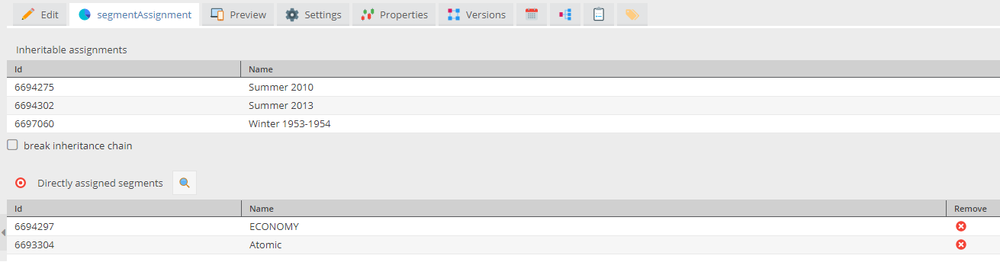
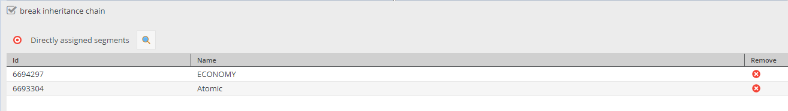

# Assigning Segments to Pimcore Elements
In addition to customers, it is also possible to assign segments to other Pimcore elements. So, elements like documents
can be tagged with segments. That information can be used later on for several use cases, e.g. tracking activities like
user xy has visited several pages that are tagged with a certain segment. So that an interaction with those elements 
creates a connection between the customer and the segment.

## Configuration

The assignment of segments can be configured to better suit your needs in the [configuration](./03_Configuration.md).

### Allowed element types

It can be defined which elements allow the assignment of segments within the symfony configuration.
The structure can be seen in the example below:

```yml
pimcore_customer_management_framework:
    segment_assignment_classes:
      types:
        document:
          page: true
          email: true
        asset:
          image: true
        object:
          object:
            Product: true
            ShopCategory: true
          folder: true
```

Below `types`, every Pimcore element type has its own sub tree where in each valid sub type 
is represented as a boolean value with the exception of `object`. 
For those, explicit class names must be specified.  
All types default to `false` so only those required need to be configured.


## Segment Assignment 
To assign segments to elements, just open the additional `Segment Assignment` tab (which is visible as soon as the 
segment assignment is activated for the certain type) and assign segments via drag & drop or the search function. 

TODO add screenshot

## Inheritance

Assignments of segments are inherited along the element's tree so they can be conveniently set for whole groups of 
elements.



However, this might not always be intended.

### Breaking the chain of inheritance

Using the checkbox, you can disable inheritance for any node in the tree and, by extension, 
remove implicitly assigned segments of parents from that node's children.




## Configuration

The assignment of segments can be configured to better suit your needs.

### Allowed element types

The types of elements segments can be assigned to are specified within the symfony configuration.
The structure can be seen in the example below:

```yml
pimcore_customer_management_framework:
    segment_assignment_classes:
      types:
        document:
          page: true
          email: true
        asset:
          image: true
        object:
          object:
            Product: true
            ShopCategory: true
          folder: true
```

Below `types`, every Pimcore element type has its own sub tree wherein each valid sub type 
is represented as a boolean value with the exception of `object`. 
For those, explicit class names must be specified.  
All types default to `false` so only those required need to be configured.

## Indexing

As an effort towards scalable performance, assigned segments, both inherited and directly assigned,
are indexed in a separate table as a simple id mapping.  

Whenever an element's assigned segments are saved using `SegmentAssignerInterface`, 
that element and its children are queued to be indexed by `IndexerInterface` which can be called via 
the `cmf:maintenance` cli command (e.g. as a [CronJob](./04_Cronjobs.md)).

## Working with assignments

### Retrieving assigned segments for an element
To retrieve segments assigned to a certain element,
[`SegmentManagerInterface::getSegmentsForElement`](https://github.com/pimcore/customer-data-framework/blob/master/src/SegmentManager/SegmentManagerInterface.php#L66) and 
[`SegmentManagerInterface::getSegmentsForElementId`](https://github.com/pimcore/customer-data-framework/blob/master/src/SegmentManager/SegmentManagerInterface.php#L77)
return an array of fully hydrated CustomerSegments.

### Filter elements by assigned segments
When working with Pimcore listings, [`QueryServiceInterface`](https://github.com/pimcore/customer-data-framework/blob/master/src/QueryService/QueryServiceInterface.php)
can provide you with a condition narrowing the results down to elements that are assigned a specific single segment, 
one or more, or all segments in an array of ids.  
The relevant element type is determined by the type of the provided Listing and the condition is directly added to it.  
Usage:
```php
<?php
$queryService = \Pimcore::getContainer()->get(QueryServiceInterface::class); //or however you access your services
$listing = new Listing();
$queryService->bySegmentIds($listing, [1, 2, 3], $concatMode = QueryServiceInterface::MODE_DISJUNCTION); // OR-concatenation
$queryService->bySegmentIds($listing, [4, 5], $concatMode = QueryServiceInterface::MODE_CONJUNCTION); // AND-concatenation

```

33