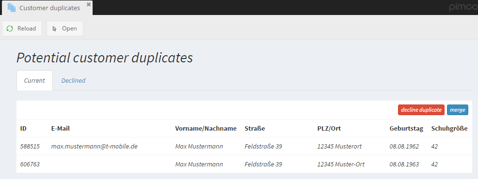

# Customer Duplicates Service

The CMF ships with a Customer Duplicates Service which helps to find, merge and avoid duplicate entries. It consists of 
three major parts:
 - Part 1 - Mechanisms for Searching Duplicates of a given Customer
 - Part 2 - Duplicates Index 
 - Part 3 - Duplicates View

The first two Parts are for configurating things running in the background. The Duplicates View on the other hand is a 
view for the user to see, validate, merge or decline potential customer duplicates in the Pimcore backend UI. 


## Part 1 - Mechanisms for Searching Duplicates of a given Customer: 
This is done directly via the database/customer object list. The duplicate service will find **active** customers where the 
configured fields are equal to the given customer. Simple strtolower/trim transformations are done so that the 
comparisons are case insensitive.

The field combination(s) which should match could be defined in the [CMF configuration file](./03_Configuration.md) in the 
`customer_duplicates_services.duplicateCheckFields` section. (Optional) multiple field combinations are supported 
(for example first check for duplicates based on `firstname/lastname/street/zip/city` - if no duplicates are found, 
check for `firstname/street/zip/city/birthDate`).

> ### Performance tip:
> Add customer save handlers for trimming duplicate check fields and afterwards add these fields to the 
> `customer_duplicates_services.duplicateCheckTrimmedFields` config section. The result is that no trim operation 
> will be needed in the resulting query. This could be a massive performance boost!


### Samples for Part 1:

```php
<?php 

// Create a new Customer Instance
$customer = new Customer();
$customer->setBirthDate(new Date('1982-12-07'));
$customer->setFirstname("Markus");
$customer->setLastname("Moser");
$customer->setZip("5020");
$customer->setPublished(true);
$customer->setActive(true);

// Get an object list with duplicates for the new customer instance (set limit to 1)
$service = $container->get('CustomerManagementFrameworkBundle\CustomerDuplicatesService\CustomerDuplicatesServiceInterface');
$duplicates = $service->getDuplicatesOfCustomer($customer, 1);


// If duplicates exist and "checkForDuplicates" is activated in the CMF config file, an exception will be thrown when
// trying to save the new customer and a duplicate exists.
try {
    $customer->save();
} catch(DuplicateCustomerException $e) {
    print "save failed - duplicate found: " . $e->getDuplicateCustomer() . PHP_EOL;
}

//get duplicates of an existing customer
$existingCustomer = Customer::getById(12345);
$duplicates = $service->getDuplicatesOfCustomer($existingCustomer, 1);
```


## Part 2 - Duplicates Index
The duplicates index is used for searching globally for (fuzzy matching) duplicates. The found duplicates will be visible 
in the customer duplicates view (see Part 3) and the user has the possibility to merge these duplicates manually.

In order to make a performant search for duplicates possible, the data is stored in a special format in the duplicate 
index. By default this is done via several MariaDB-Tables. But it would also be possible to create a 
DuplicateIndex for ElasticSearch by implementing the `DuplicateIndexInterface`.

The duplicates index can be configured in the [configuration file](./03_Configuration.md). Data and logic for 
storing duplicates within the index is configured as follows: 
 
### Example Config

```yaml
pimcore_customer_management_framework:
duplicates_index:
    enableDuplicatesIndex: true

    duplicateCheckFields:
      - firstname:
          soundex: true
          metaphone: true
          similarity: \CustomerManagementFrameworkBundle\DataSimilarityMatcher\SimilarText

        zip:
          similarity: \CustomerManagementFrameworkBundle\DataSimilarityMatcher\Zip

        street:
          soundex: true
          metaphone: true
          similarity: \CustomerManagementFrameworkBundle\DataSimilarityMatcher\SimilarText

        birthDate:
          similarity: \CustomerManagementFrameworkBundle\DataSimilarityMatcher\BirthDate::class

      - lastname:
          soundex: true
          metaphone: true
          similarity: \CustomerManagementFrameworkBundle\DataSimilarityMatcher\SimilarText

        firstname:
          soundex: true
          metaphone: true
          similarity: \CustomerManagementFrameworkBundle\DataSimilarityMatcher\SimilarText

        zip:
          similarity: \CustomerManagementFrameworkBundle\DataSimilarityMatcher\Zip

        city:
          soundex: true
          metaphone: true
          similarity: \CustomerManagementFrameworkBundle\DataSimilarityMatcher\SimilarText

        street:
          soundex: true
          metaphone: true
          similarity: \CustomerManagementFrameworkBundle\DataSimilarityMatcher\SimilarText


      - email:
          metaphone: true
          similarity: \CustomerManagementFrameworkBundle\DataSimilarityMatcher\SimilarText
          similarityThreshold: 90

    dataTransformers:
      street: \CustomerManagementFrameworkBundle\DataTransformer\DuplicateIndex\Street
      firstname: \CustomerManagementFrameworkBundle\DataTransformer\DuplicateIndex\Simplify
      city: \CustomerManagementFrameworkBundle\DataTransformer\DuplicateIndex\Simplify
      lastname: \CustomerManagementFrameworkBundle\DataTransformer\DuplicateIndex\Simplify
      birthDate: \CustomerManagementFrameworkBundle\DataTransformer\DuplicateIndex\Date
```

It's possible to define the field combinations which should match within the 
`customer_duplicates_services.duplicates_index.duplicateCheckFields` section.

For each field in these field combinations it is possible to define how it should be indexed with the following four options:
- **soundex**: If set to `true`, the field should be relevant for soundex matching. This should be enabled for text fields 
where a soundex matching could make sense. For example for a `zip` field it's not really useful whereas for `firstname` it 
would be a good idea to enable it :-).

- **metaphone**: Same like soundex but another phonetic algorithmn (metaphone). It's possible to combine soundex + metaphone 
but sometimes it could be useless and a waste of resources to enable both. If you are not sure just enable both. 
  
- **similarity**: Searching duplicates by soundex/metaphone will produce a lot of false positive matches. Especially if 
there are fields like `zip` where soundex + metaphone should be disabled a mechanism for excluding these false positives 
is needed. But also the soundex/metaphone algorithm itself will produce many false positives. In the similarity field 
it is possible to configure a so called SimilarityMatcher 
(see [`DataSimilarityMatcherInterface`](https://github.com/pimcore/customer-data-framework/blob/master/src/DataSimilarityMatcher/DataSimilarityMatcherInterface.php#L18)). 
All potentially found duplicates by soundex/metaphone search will be compared by these SimilarityMatchers. Only if all 
fields are similar according to the SimilarityMatchers the found duplicate will be handled as "real" duplicate. Otherwise 
it's a false positive.

- **similarityThreshold**: Each SimilarityMatcher has a default threshold - but it's possible to (optionally) define a 
custom threshold which will be handed over to the SimilarityMatcher.


### Console Command

Following console command is available to calculate and update the duplicates index. If needed, it should be configured
as [CronJob](./04_Cronjobs.md).

```
php pimcore/cli/console.php cmf:duplicates-index
```

**Options:**
- `-c` - Calculate potential duplicates. This needs to run as cron job, for example once a day.
- `-a` - Analyse false positives. If set, false positives will be logged (by default in the plugin_cmf_duplicates_false_positives table).
- `-r` - Recreate index. Recreate the total index for all customers.


## Part 3 - Duplicates View
The duplicates view is the frontend for manually checking, merging or declining potential duplicates found based on the
duplicates index. 
It gets populated when the console commands of the duplicates index are executed and its usage should be quite self explaining. 


