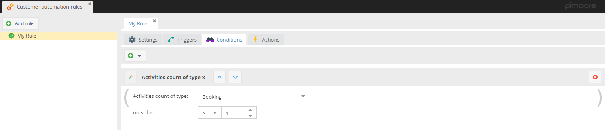

# ActionTrigger Services - Customer automation rules

The CMF plugin offers tools to automate customer related actions based on rules. Every rule consists of one or more
triggers, a condition and one or more actions. 

Currently following implementations of triggers, conditions and actions are available: 

**Trigger**
- New Customer Activity: A new customer activity is added for a customer.
- Segment Building: The segment building process is running. 
- Cron: Trigger fires based on the defined cron definition. See also [Cronjobs](./04_Cronjobs.md) for correct configuration. 
- [Targeting] Segment Tracked: When a segment is tracked via Pimcore targeting. For more details see 
  [Personalization](./30_Personalization/README.md) chapter.
- [Targeting] Assigned Target Group: When a target group is assigned via Pimcore targeting. 
  For more details see [Personalization](./30_Personalization/README.md) chapter.

**Conditions**
- Activities Count of Type X: Customer has a certain amount of activities of a certain type. 
- Customer: Only apply rule for a specific customer.
- Customer Segment: Only apply rule for customers with a specific segment assigned. 
- [Targeting] Tracked Segments Count: Checks count of tracked segment that issued the trigger. For more details see 
  [Personalization](./30_Personalization/README.md) chapter.
- [Targeting] Check Weight of Assigned Target Group: Checks weight of assigned target group that issued the trigger. 
  For more details see [Personalization](./30_Personalization/README.md) chapter. 
- Customer Field: Only apply rule for customer with specific value in given field.

The Conditions can be combined with AND, OR, AND NOT and brackets. 

**Actions** 
- Add Segment: Adds a segment to the customer. Optionally all other segments of the same group are removed, the segment
  application counter is increased and an action delay can be defined (execute action a certain 
  amount of time after the trigger & condition matched). 
  Additionally it's possible to configure, if the `profilingConsent` attribute of the customer object should be considered.
- Change Customer Field Value: Change the value of a certain field of the customer object. Optionally an action
  delay can be defined (execute action a certain amount of time after the trigger & condition matched).
- [Targeting] Add tracked segment: Adds the tracked segment that issued the trigger to current customer. 
  Optionally all other segments of the same group are removed, the segment application counter is 
  increased and an action delay can be defined (execute action a certain amount of time after the trigger & condition matched).
  Additionally it's possible to configure, if the `profilingConsent` attribute of the customer object should be considered.
  For more details see [Personalization](./30_Personalization/README.md) chapter.
- [Targeting] Add Target Group Segment: Adds the to the target group linked segment that issued the trigger. 
  Optionally all other segments of the same group are removed, the segment application counter is 
  increased and an action delay can be defined (execute action a certain amount of time after the trigger & condition matched).
  For more details see [Personalization](./30_Personalization/README.md) chapter.
- Send Mail: Sends an email (optionally to the customer - default true). It is possible to use placeholders with fields of the customer object in the path of the email document to for example send different emails based on language and an action delay can be defined (execute action a certain amount of time after the trigger & condition matched). Additionally it's possible to configure, if the `profilingConsent` attribute of the customer object should be considered.
  For more details see [Personalization](./30_Personalization/README.md) chapter.
	
  

## Implement Custom Elements of Rules
Custom implementations for triggers, conditions and actions can be added by additional bundles. To do so, the server-side
part and the frontend part have to be added by
- implementing a php class in a certain namespace and extending an abstract class
- implementing a javascript class in a certain namespace and extending an abstract class. 

As reference use the implementations provided by the CMF, e.g. `AddSegment` action with 
[php part](https://github.com/pimcore/customer-data-framework/blob/master/src/ActionTrigger/Action/AddSegment.php) and 
[javascript-part](https://github.com/pimcore/customer-data-framework/blob/master/src/Resources/public/js/config/actions.js#L61).    
