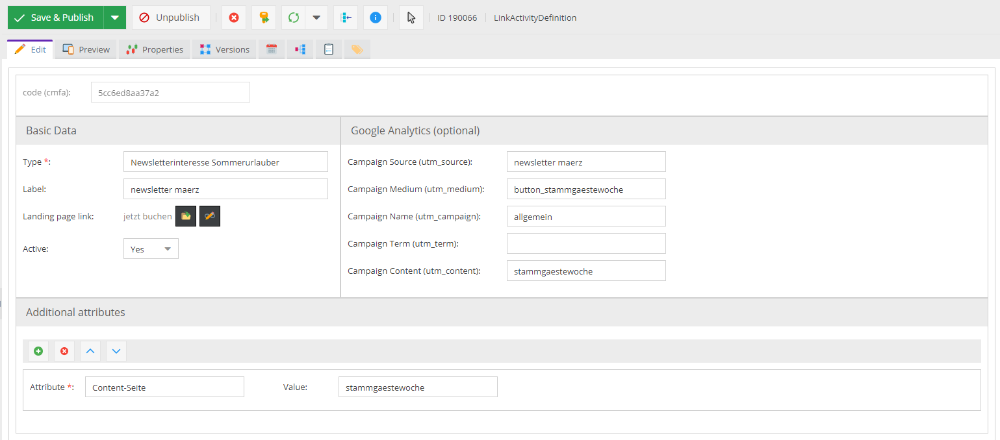
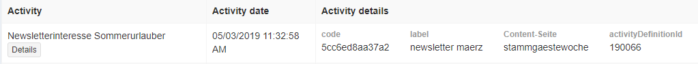

# Link Activity Tracking

The CMF provides you with features to track opened links of newsletters as customer activities. So you can track activities
directly in customer object within Pimcore and use this information for further processing (like assigning customer 
segments, etc.) and personalization. 

## Functionality in a Nutshell
- Central definition object for creating links in newsletters.
- Created links link to a landing page and consider additional parameters for tracking
  - Campaign tracking in google analytics 
    - with UTM parameter
  - Activity tracking for each customer in CMF 
    - via cmfc parameter
    - by default filled with merge tag (e.g. `cmfc=*|ID_ENCODED|*`), customer id needs to be replaced while newsletter sending
      (e.g. by mailchimp).
       

## Detailed Configuration Workflow

1) Create `LinkActivityDefinition` object and fill out data (at least `Type` and `Landing page link`)


2) Link `LinkActivityDefinition` object in link in newsletter (just via d&d) - Pimcore generates corresponding link to landing page with all parameters.
  
  > Link will look like something like that: `https://demo.pimcore.fun/en?utm_source=newsletter&utm_medium=button&utm_campaign=summer&cmfa=5ccc38eacb2be&cmfc=*|ID_ENCODED|*` 

3) Send newsletter via newsletter provider, e.g. mailchimp

  > There the merge tag (`*|ID_ENCODED|*`) needs to be replaced with the correct customer id

4) As soon as a customer clicks the link in the newsletter and opens the landing page, a corresponding activity will be 
   tracked for customer: 
   - Type = Type in `LinkActivityDefinition` object
   - All additional attributes in `LinkActivityDefinition` object will be added as attributes in the activity
   
   

## Additional Configuration
In CMF symfony configuration tree, there are two options for the link activity tracker:
```yml 
    activity_url_tracker:
          enabled: true
          # used for automatic link generation of LinkActivityDefinition data objects
          linkCmfcPlaceholder: '*|ID_ENCODED|*'
```
- enabled: Enable or disable the link tracking in general.
- linkCmfcPlaceholder: Define placeholder for customer id that needs to be replaced when sending newsletter. Default value
is for mailchimp.  


## Usage in combination with built-in Newsletter sending
Link activity tracking can also be used with internal Pimcore newsletters. Configuration workflow stays the same, the 
only thing that needs to be adapted it the `linkCmfcPlaceholder` in configuration tree: 

```yml 
    activity_url_tracker:
        enabled: true
        # used for automatic link generation of LinkActivityDefinition data objects
        linkCmfcPlaceholder: '%Text(ID_ENCODED);'
```