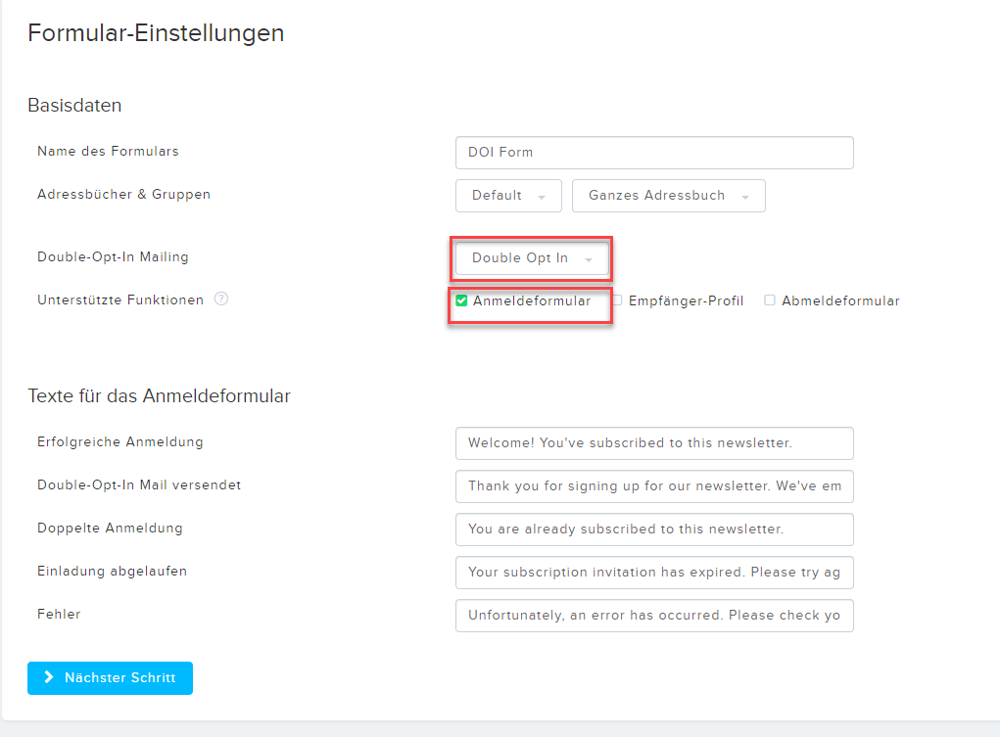
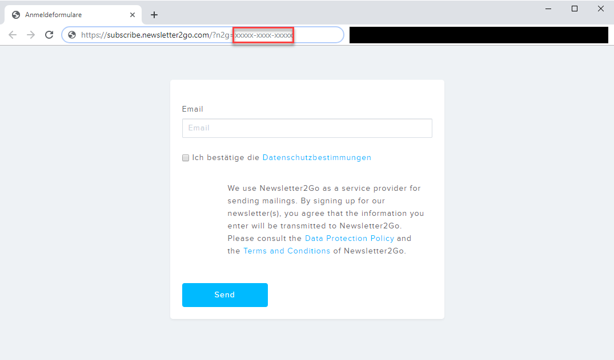
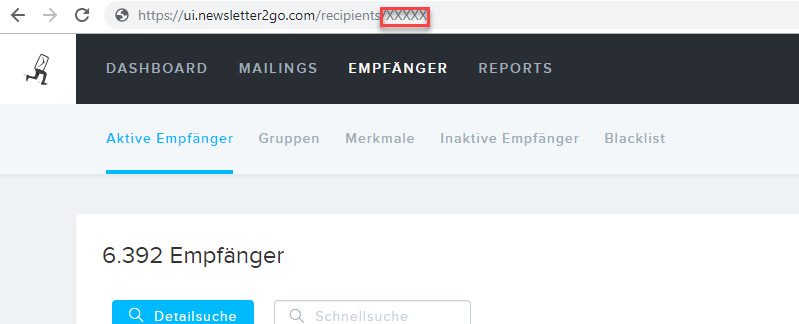

# Newsletter2Go

## Customer
If the Newsletter sync feature is enabled, the Customer data object class needs to implement the `NewsletterProviderHandlerInterface`. 

## Find Your Configuration Data

### Find Double Opt In Code
Go to https://ui.newsletter2go.com/forms and create your double opt in form. 

In the next step click to view your hosted form.

You can find the code in the url: 

### Checking users in Newsletter2Gos webinterface
Sometimes it takes a really long time for Customers to actually show up within Newsletter2Go's web interface. It is therefore better to use the API to check if a user exists or not.

### Find your login Data / API key
Go to: https://ui.newsletter2go.com/api-client

### Find your listid
Go to: https://ui.newsletter2go.com/lists
Choose your list and go to that page.
Get the listId from the url:
