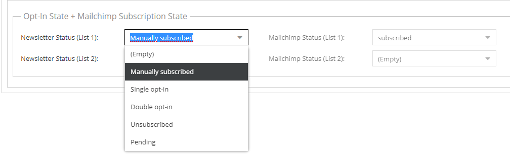
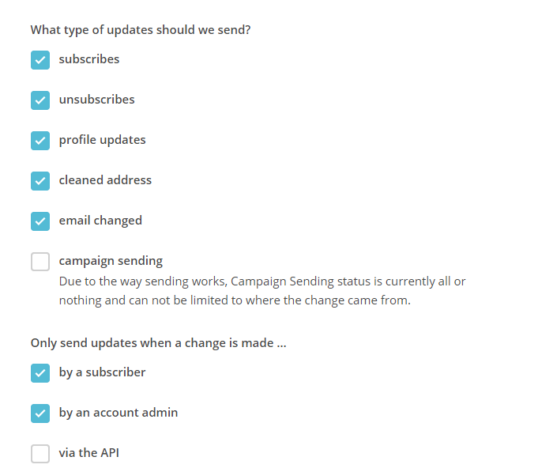
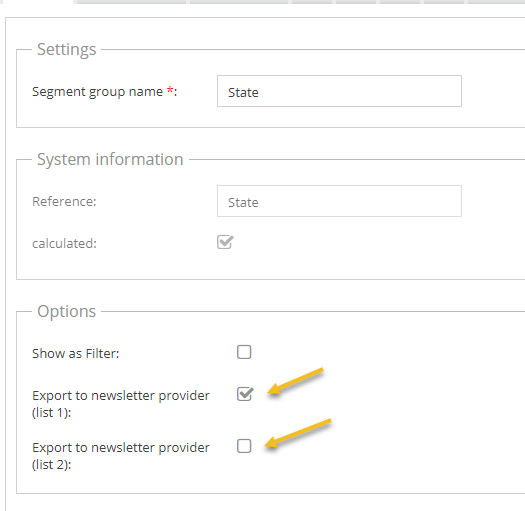
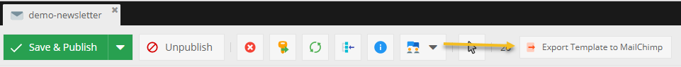
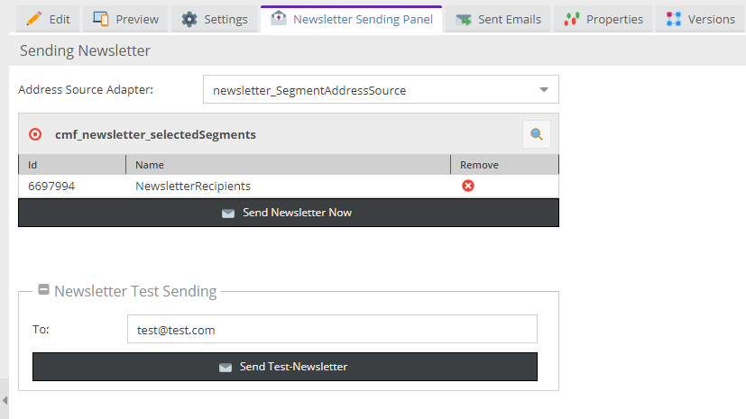

# MailChimp/Newsletter Sync

The CMF offers built-in support for synchronizing customer data with MailChimp. It synchronizes configured parts of the 
customer data and optionally also can export mail templates based on Pimcore mail documents. 

> Other newsletter systems could be integrated too by implementing the `NewsletterProviderHandlerInterface`.

## Configuration

The newsletter synchronisation has to be enabled in CMF configuration. Additional configurations are
- `newsletterQueueImmediateAsyncExecutionEnabled`: customer is synchronized with MailChimp on every save. 
- MailChip API settings. 

Further than that, the CMF can handle multiple MailChimp lists. Each list is one separate symfony service tagged with 
`cmf.newsletter_provider_handler`. 

See [Configuration](../03_Configuration.md) for an example configuration of such a service and for a list of general 
newsletter related settings.

See [Multiple Mailchimp Accounts](./MultipleMailchimpAccounts.md) if you need to handle lists within different Mailchimp accounts.


## Prepare Data Objects for MailChimp Sync

### Customer

It's needed to add a `newsletterStatus` and `mailchimpStatus` field into the customer class for each MailChimp list:  



The fields need to be named with the shortcut of the associated provider handler as a suffix (e.g. `newsletterStatusList1` 
and `mailchimpStatusList1`). 

The newsletter status is a project-specific setting. A mapping between the status options and the MailChimp status options 
need to be done in the service definition of the provider handler.

The MailChimp status needs to be a read only field with the following options:
- `subscribed`
- `unsubscribed`
- `pending`
- `cleaned`


If the MailChimp sync feature is enabled, the Customer data object class needs to implement the `MailchimpAwareCustomerInterface`. 

This interface offers one method: 
`public function needsExportByNewsletterProviderHandler(NewsletterProviderHandlerInterface $newsletterProviderHandler);`


This method could be used to decide, if a customer needs to be exported to a given MailChimp list (most of the time you will do 
this by the configured shortcut of the MailChimp provider handler). With this mechanism it's possible to create different 
lists with different customers based on some kind of rules. 


### CustomerSegmentGroup
Besides customers, also customer segments can be exported as interest groups to MailChimp. To configure that, add a checkbox 
called `exportNewsletterProvider{PROVIDER_HANDLER_SHORTCUT}` for each list to the `CustomerSegmentGroup` class. 
See below for more details.


## Exporting Customers to MailChimp

### Newsletter Queue

Exporting customer data to MailChimp is handled asynchronously. This means, that each time when a customer get's saved it 
will be added to the newsletter queue (represented by a database table).

A cronjob in the background, which should run every few minutes, then processes the queue items. If they were successfully 
processed, they will be removed from the queue. 

If the sync does not work (e.g. because MailChimp does not respond properly, etc.) they stay in the queue and will be 
executed later on. See also [CronJobs](../04_Cronjobs.md).

##### Immediate execution of export on customer save

Although the export is handled asynchronously it is possible to enable that a queue entry will be processed immediately 
after a customer is saved. This will still run as background task. The queue will be only triggered asynchronously exactly 
for the saved customer. If the export is not successful, the entry will stay in the queue. 

The config option for this behaviour is called `newsletterQueueImmediateAsyncExecutionEnabled` 
(see [Configuration](../03_Configuration.md)).


### Webhook 

The CMF offers a MailChimp webhook endpoint to receive updates from MailChimp. The webhook is implemented as webservice 
and is handled the same way as the REST webservice in the Pimcore core.

So the steps to enable the webhook are as following:
- Enable the Pimcore core webservice feature.
- Create a Pimcore user for handling the webhook (e.g. "mailchimp-webhook"). 
- Generate an api key for the Pimcore user.
- Add a webhook in the MailChimp web interface with the following URL: 
  `https://mydomain.com/__customermanagementframework/webservice/mailchimp/webhook?apikey=53c5f6f3427545e712fe59ce043489f86ee0eb4b64a7c098d89d4288167eec1c`
  The webhook needs to be configured like this:
  

> **Caution: Pimcore should be the master data base. Therefore no changes of user data (e.g. interest groups) within 
MailChimp should be allowed. The CMF processes updates of simple merge fields but it's much better to disallow such updates. 
Customer segments/interest groups definitely can not be synced back to Pimcore.**

### Cronjob for syncing data from MailChimp to Pimcore

The webhook makes it possible that updates in MailChimp are synced in more or less real time to Pimcore. But sometimes 
this might not work (for example when the server is down). Therefore the CMF offers an additional cronjob, which could 
run once a day and synchronize needed updates to Pimcore. See also [CronJobs - Mailchimp status sync](../04_Cronjobs.md).


## Exporting CustomerSegments to MailChimp

Customer segment exports are handled by the newsletter queue too (see above). MailChimp has a limit of 60 interest groups 
(the equivalent for CustomerSegments in MailChimp) per list. Therefore the CMF offers a configuration option for what 
CustomerSegmentGroups should be exported (all segments within this group will be exported).



It's necessary to add a checkbox `exportNewsletter{PROVIDER_HANDLER_SHORTCUT}` for each provider handler (mailchimp list) 
into the CustomersSegmentGroup data objects.

## Exporting newsletter templates to MailChimp

As soon as the newsletter sync is enabled, a "Export Template to MailChimp" button will appear in email documents:



With this it's possible to create the newsletter within Pimcore and then use it for emailing campaigns within MailChimp.


## Logging

The CMF logs MailChimp sync related changes on three different levels:
- Customer activities are tracked on each MailChimp status change
- In the notes and events tab of the customer a list of successful exports will be shown.
- Errors are logged into the application logger.  

# Addressing a customer segment with Pimcore's own newsletter functionality

The CMF comes equipped with its own address source adapter, selectable from the Newsletter Sending Panel in newsletter documents.



Here multiple customer segments can be selected to send a newsletter to all customers related to any of them.
For this adapter to become available it must be configured as shown in the example below:

```yml
pimcore:
    newsletter:
        source_adapters:
            SegmentAddressSource: cmf.document.newsletter.factory.segmentAddressSource
```
