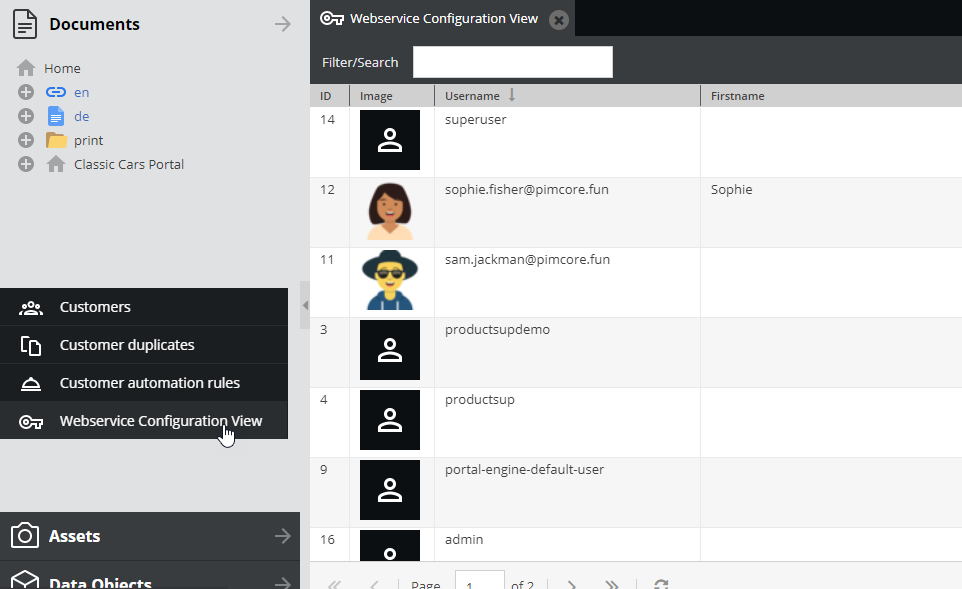

# Webservice

The CMF plugin has a built-in REST webservice. Access is handled via API-Keys, which can be configured
for Pimcore Users in settings menu of CMF. 

Add the API-Key as `X-API-Key` HTTP header (recommended) or `apikey` url parameter to your request. 

The webservices also support session authentication, this means that it's not necessary to add the `X-API-Key` HTTP header 
or the `apikey` parameter to the request if you have a valid user session from the admin interface 
(eg. when testing in the browser).

Don't forget to setup the symfony firewall in your `security.yml`, 
details see [installation instructions](./02_Installation/README.md). 




## API Reference

### Customers API

The customers API implements standard REST calls for customer CRUD actions:

| Path                                                     | Method | Description                 |
|----------------------------------------------------------|--------|-----------------------------|
| /__customermanagementframework/webservice/customers      | GET    | Fetch all customers         |
| /__customermanagementframework/webservice/customers/{id} | GET    | Fetch a single customer     |
| /__customermanagementframework/webservice/customers      | POST   | Create a new customer       |
| /__customermanagementframework/webservice/customers/{id} | PATCH  | Partially update a customer |
| /__customermanagementframework/webservice/customers/{id} | DELETE | Delete a customer           |

The `GET` requests can be filtered by passing the following params as query params:

| Parameter             | Possible Values               | Description                                                 |
| --------------------- |-----------------------------  |-----------------------------------------------------------  |
| includeActivities     | true/false                    | include activities of customer into result set              |
| segments              | comma-separated list of IDs   | filter by segments                                          |
| page                  | int                           | page number for paging                                      |
| pageSize              | int                           | page size   for paging                                      |
| modificationTimestamp | int                           | filter for customers with newer ModificationTimestamp       |


### Activities API

The activities API implements standard REST calls for activity CRUD actions:

| Path                                                      | Method | Description                   |
|-----------------------------------------------------------|--------|-------------------------------|
| /__customermanagementframework/webservice/activities      | GET    | Fetch all activities         |
| /__customermanagementframework/webservice/activities/{id} | GET    | Fetch a single activity      |
| /__customermanagementframework/webservice/activities      | POST   | Create a new activity        |
| /__customermanagementframework/webservice/activities/{id} | PATCH  | Partially update a activity  |
| /__customermanagementframework/webservice/activities/{id} | DELETE | Delete a activity            |

The `GET` requests can be filtered by passing the following params as query params:

| Parameter             | Possible Values               | Description                                                    |
| --------------------- |-----------------------------  |--------------------------------------------------------------- |
| type                  | string                        | filter by activity type                                        |
| modifiedSinceTimestamp| timestamp/int                 | get activities which where modified since given timestamp      |
| page                  | int                           | page number for paging                                         |
| pageSize              | int                           | page size   for paging                                         |

### Deletions API

The deletions API delivers information about deletions of customers and activities:

| Path                                                      | Method | Description                   |
|-----------------------------------------------------------|--------|-------------------------------|
| /__customermanagementframework/webservice/deletions       | GET    | Fetch all segments            |

The request can be filtered by passing the following params as query params:

| Parameter               | Possible Values               | Description                                                    |
| ----------------------- |-----------------------------  |--------------------------------------------------------------- |
| entityType              | customers/activities          | get deletions of customers or activities                       |
| deletionsSinceTimestamp | timestamp/int                 | get deletions since given timestamp only                       |


### Segments API

The segments API implements standard REST calls for customer segment CRUD actions:

| Path                                                      | Method | Description                   |
|-----------------------------------------------------------|--------|-------------------------------|
| /__customermanagementframework/webservice/segments        | GET    | Fetch all segments            |
| /__customermanagementframework/webservice/segments/{id}   | GET    | Fetch a single segment        |
| /__customermanagementframework/webservice/segments        | POST   | Create a new segment          |
| /__customermanagementframework/webservice/segments/{id}   | PATCH  | Partially update a segment    |
| /__customermanagementframework/webservice/segments/{id}   | DELETE | Delete a segment              |

The `GET` requests can be filtered by passing the follwing params as query params:

| Parameter             | Possible Values               | Description                                                    |
| --------------------- |-----------------------------  |--------------------------------------------------------------- |
| page                  | int                           | page number for paging                                         |
| pageSize              | int                           | page size   for paging                                         |

### Segment groups API

The segment groups API implements standard REST calls for customer segment group CRUD actions:

| Path                                                            | Method | Description                           |
|-----------------------------------------------------------------|--------|---------------------------------------|
| /__customermanagementframework/webservice/segment-groups        | GET    | Fetch all segment groups              |
| /__customermanagementframework/webservice/segment-groups/{id}   | GET    | Fetch a single segment group          |
| /__customermanagementframework/webservice/segment-groups        | POST   | Create a new segment group            |
| /__customermanagementframework/webservice/segment-groups/{id}   | PATCH  | Partially update a segment group      |
| /__customermanagementframework/webservice/segment-groups/{id}   | DELETE | Delete a segment group                |

The `GET` requests can be filtered by passing the following params as query params:

| Parameter             | Possible Values               | Description                                                    |
| --------------------- |-----------------------------  |--------------------------------------------------------------- |
| page                  | int                           | page number for paging                                         |
| pageSize              | int                           | page size   for paging                                         |

### Segments of customers API

The segments of customers API allows to add segments to customers and remove segments form customers:

| Path                                                            | Method | Description                           |
|-----------------------------------------------------------------|--------|---------------------------------------|
| /__customermanagementframework/webservice/segments-of-customers | POST   | Add/remove segments                   |

``` 
Example POST body JSON:
{
    "customerId": 12345,
    "addSegments": [123,456],
    "removeSegments": [567,789]
}
```