# List Views

The CMF provides two additional views for visualizing the data in Pimcore backend UI.

## Customer View

The customer view is a list view of customers with additional filter and export functionality and few configuration 
possibilities. It can be opened via the main menu in Pimcore backend UI and lists all customers that are matching the 
filter criteria independently of their location in the object tree. Although users will only see customers which they have the permission to access.

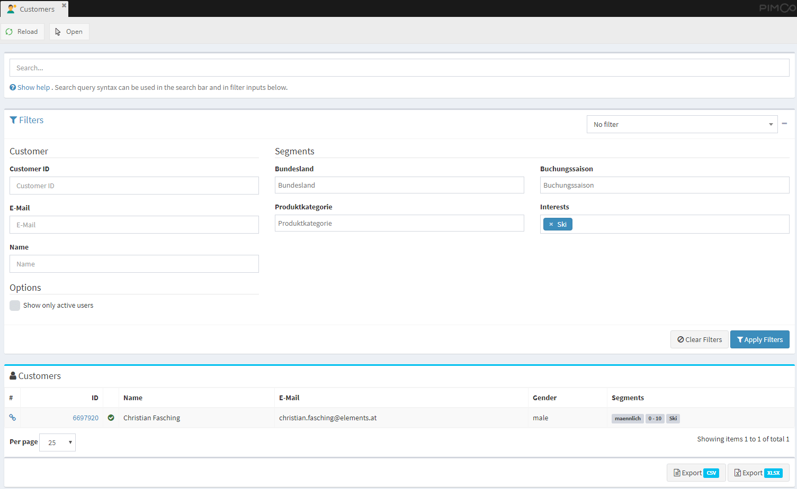

#### Configuration options
- **Search Columns**: In [CMF configuration](./03_Configuration.md) it can be configured which columns should be considered 
  during searching and filtering in the customer list. For details see the [CMF configuration section](./03_Configuration.md).
   
- **Filter for Segments**: The customer view also allows for filtering based on assigned segments. This can be configured
  based on the `CustomerSegmentGroup` objects by activating the `Show as Filter` option. The sort order of the segments can
  be changed by providing the `Filter sort order` (high to low sorting).
  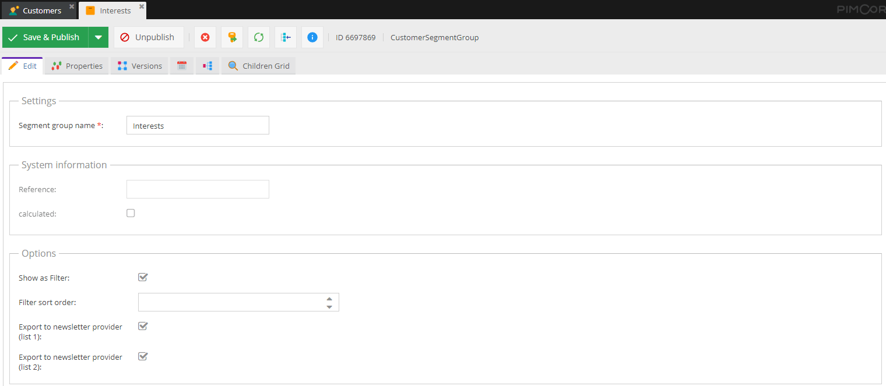
  
- **Exporters**: It is possible to configure exports for exporting all customers that are currently shown in the customer view. 
  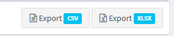
  
  These exports can be configured in [CMF configuration](./03_Configuration.md) by configuring `name`, `icon`, a `exporter` class
  and certain `properties` that need to be exported. The `exporter` class is a php class that defines the export format 
  of the export. Currently there are implementations for `csv` and `xlsx` available. 
  
  It is possible to configure multiple exporters.  For details see the [CMF configuration section](./03_Configuration.md). 
  

In addition to the global customer view, in `CustomerSegment` objects edit view, an additional tab with customers that 
have assigned the segment is added: 

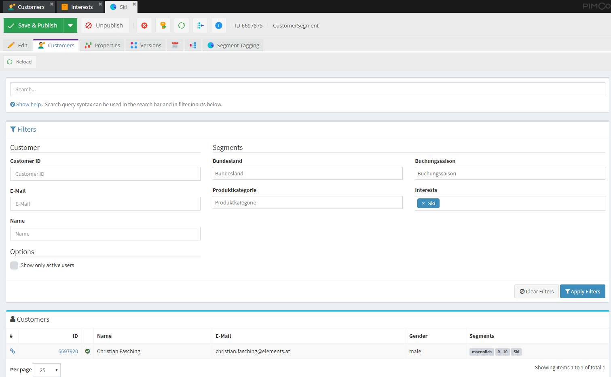

Additional filter settings will be hidden when viewing customers of a segment directly.

When selecting a customer in the list, the detail view of this customer is opened. By default this detail view is a very 
basic view that shows all attributes of the customer. Optionally, a custom view can be provided by overwriting the 
`cmf.customer_view` service in symfony container and overwriting the `public function getDetailviewTemplate(CustomerInterface $customer)`
method, that returns the path to the template of the customer (by default `PimcoreCustomerManagementFrameworkBundle:Admin/Customers/partials:detail.html.php`).  

In the same service, also the presentation of a customer in the customer listing can be customized. Just overwrite the 
`public function getOverviewTemplate(CustomerInterface $customer)` method and return the path to the custom template.  

#### Advanced Filter Settings

For reuse of defined filters, it is possible to save a configured filter. The advanced filter setting are 
only available when accessing the customer view via the menu and will be hidden when viewing customers of a specific segment.
Every user can add new filters and update their existing filters. If an user has the permission `CMF Customer Filter-Admin` he is also able to 
update all filters shared with them. For sharing filters with other users the user needs to have the permission `Share configurations`. 
User with the `Share configurations` permission can share their own filters or re-shared filters shared with them to other users.

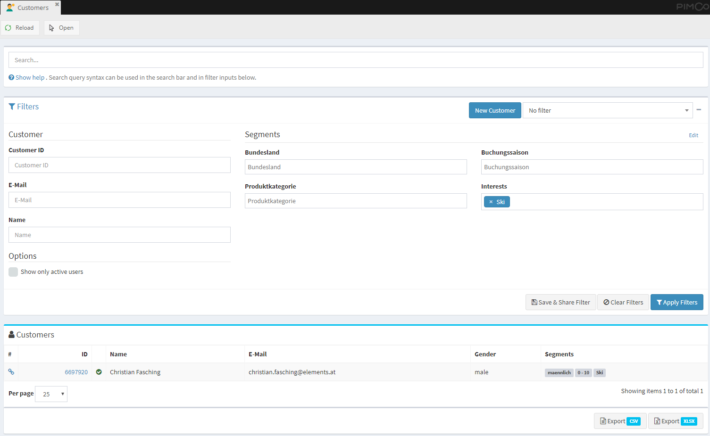

The available segments can be changed via the **Edit** Button in the segments area of the filters section.

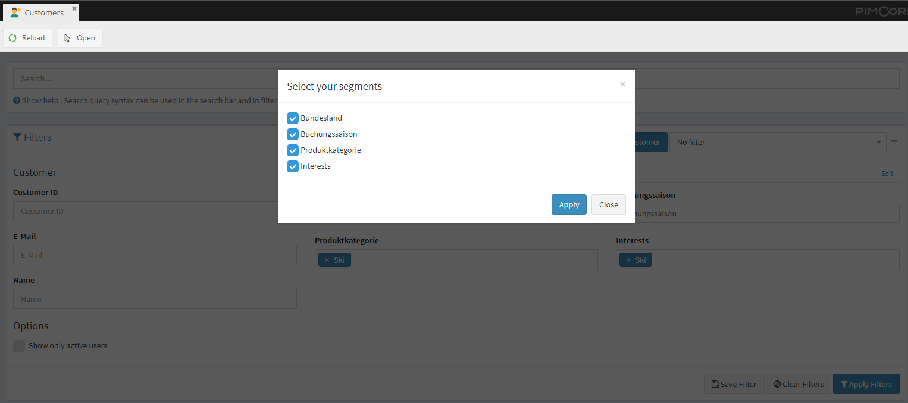

##### Creating new filters

All Users will have the possibility to select, save and update their defined filters by defining filter criteria for 
customer fields in the `Customer` section and select segments in the `Segments` section. 
By clicking the `Save Filter` button a new dialog will be opened. In this dialog the filter can also be shared with users 
and roles if the user has the permission `Share configurations`. 

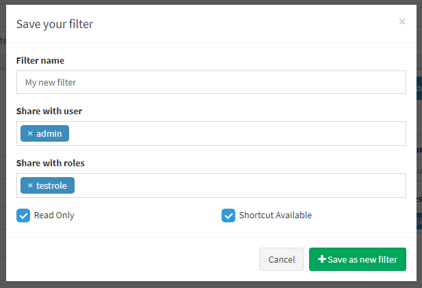

If the defined filter criteria should not be changed it is possible to lock the filter fields by setting the `Read Only` option. 
When the filter should be available directly via the menu (for the user itself and all shared users / roles) the option `Shortcut Available` should be set. 
By saving the filter it will be automatically selected in filter selection. When editing an existing filter an additional
button will be available in the `Save & Share Filter` or `Save Filter` dialog to update the specific filter definition.

##### Sharing filters

Users can access filters shared with them either via the customers menu and by selecting the filter or directly via the menu
if the `Shortcut Available` option was set for the filter.

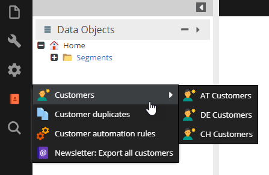

Users can re-share their shared filters when they have the `Share configurations` permission by clicking the `Share Filter` 
button and providing users or roles, but they are not allowed to remove existing users or roles from the filter definition. 
Only users with permission `CMF Customer Filter-Admin` or filter owners them self will have the possibility to remove 
existing shares via updating the filter definition.

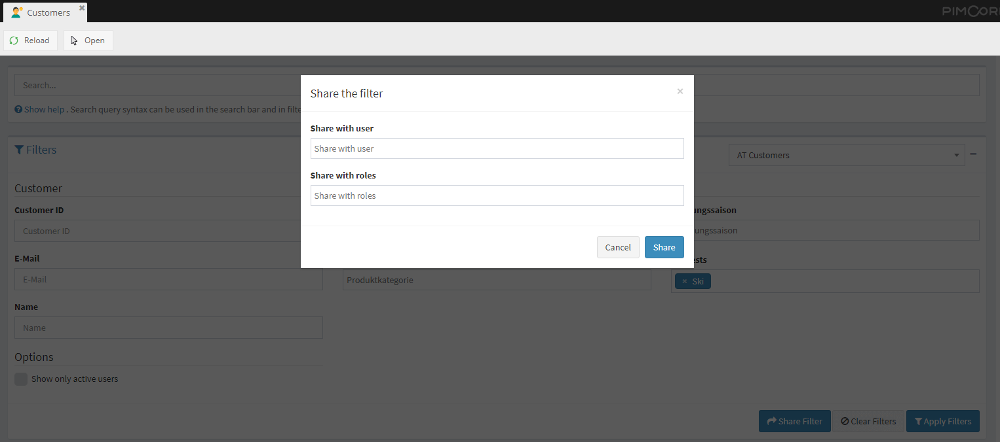

##### Creating new customer object

For quickly adding new customers a button is available inside the `Filters` section beside the filter selection. This button is 
only available if the user has `save` permission to temporary new customer directory set in [CMF configuration](./03_Configuration.md) 
key `pimcore_customer_management_framework -> customer_provider -> newCustomersTempDir`. By clicking the `New Customer` button a 
new customer will be created (and opened) inside the defined directory. When the automatic naming scheme is enabled, the customer will be moved to the corresponding directory after clicking the save button.

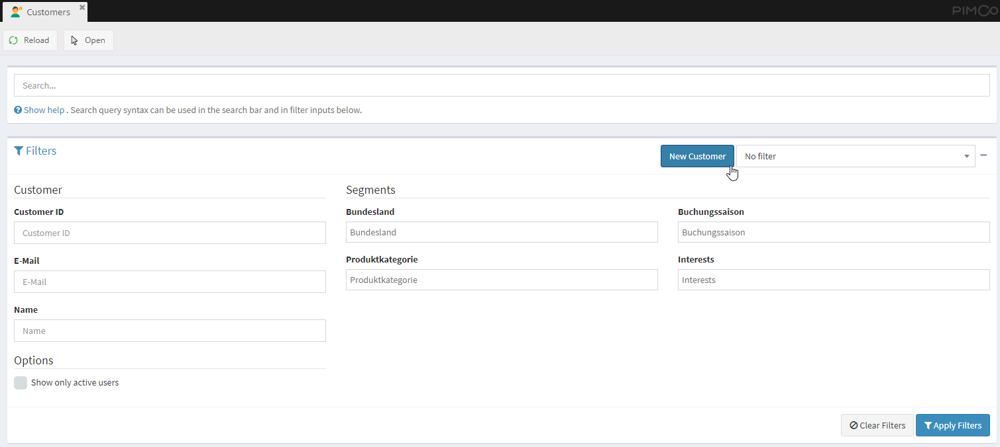

## Activity View

The activity view provides a overview of all activities of a certain customer and is shown as additional tab in the 
customer object editor. 

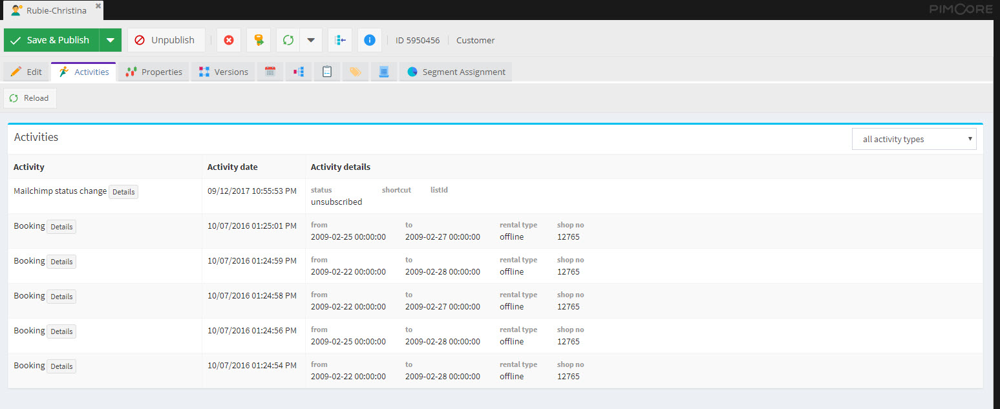

For each activity also a detail page is available.  

##### Configuration options
- **Activity details in list view**: The information of an activity shown in the activity list is defined by the activity 
implementation with the method 
[`public static function cmfGetOverviewData(ActivityStoreEntryInterface $entry)`](https://github.com/pimcore/customer-data-framework/blob/master/src/Model/ActivityInterface.php#L112). 
It should return an associative array of all data that should be shown.  
- **Activity Detail Page**: There are two ways of configuring the content of the activity detail page. 
    1) Implement the method [`public static function cmfGetDetailviewData(ActivityStoreEntryInterface $entry);`](https://github.com/pimcore/customer-data-framework/blob/master/src/Model/ActivityInterface.php#L121) 
       which should return an associative array of all data. This data is shown in a two-column list by default.  
    2) Implement the method [`public static function cmfGetDetailviewTemplate(ActivityStoreEntryInterface $entry);`](https://github.com/pimcore/customer-data-framework/blob/master/src/Model/ActivityInterface.php#L130)
       which can return the path to a template file in order to implement a complete custom template.
       