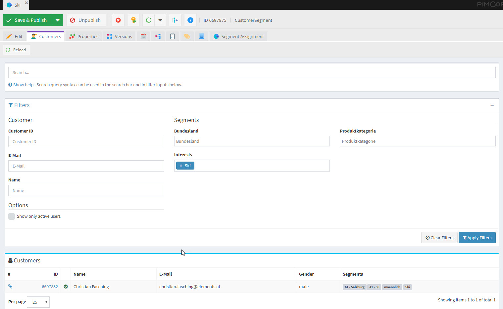
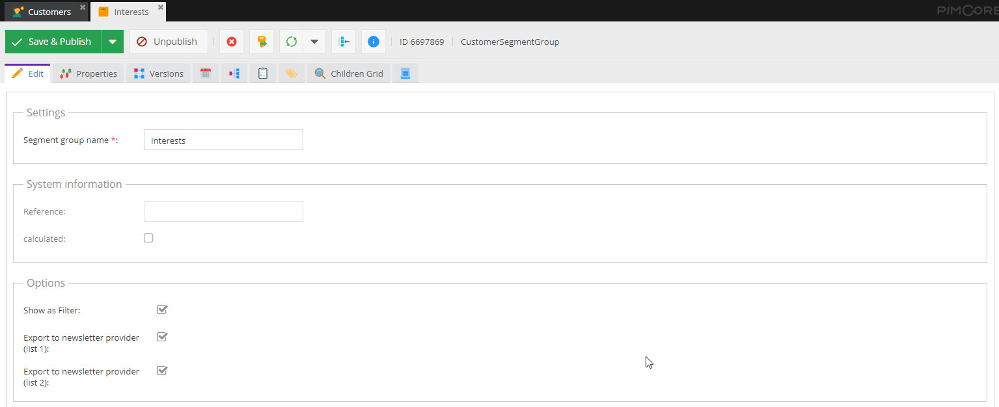

# List Views

The CMF provides two additional views for visualizing the data in Pimcore backend UI. 

## Customer View

The customer view is a list view of customers with additional filter and export functionality and few configuration 
possibilities. It can be opened via the main menu in Pimcore backend UI and lists all customers that are matching the 
filter criteria independently of their location in the object tree.  

##### Configuration options
- **Search Columns**: In [CMF configuration](./03_Configuration.md) it can be configured which columns should be considered 
  during searching and filtering in the customer list. For details see the [CMF configuration section](./03_Configuration.md). 
- **Filter for Segments**: The customer view also allows for filtering based on assigned segments. This can be configured
  based on the `CustomerSegmentGroup` objects by activating the `Show as Filter` option.
   
- **Exporters**: It is possible to configure exports for exporting all customers that are currently shown in the customer view. 
  
  
  These exports can be configured in [CMF configuration](./03_Configuration.md) by configuring `name`, `icon`, a `exporter` class
  and certain `properties` that need to be exported. The `exporter` class is a php class that defines the export format 
  of the export. Currently there are implementations for `csv` and `xlsx` available. 
  
  It is possible to configure multiple exporters.  For details see the [CMF configuration section](./03_Configuration.md). 
  

In addition to the global customer view, in `CustomerSegment` objects edit view, an additional tab with customers that 
have assigned the segment is added: 

When selecting a customer in the list, the detail view of this customer is opened. By default this detail view is a very 
basic view that shows all attributes of the customer. Optionally, a custom view can be provided by overwriting the 
`cmf.customer_view` service in symfony container and overwriting the `public function getDetailviewTemplate(CustomerInterface $customer)`
method, that returns the path to the template of the customer (by default `PimcoreCustomerManagementFrameworkBundle:Admin/Customers/partials:detail.html.php`).  

In the same service, also the presentation of a customer in the customer listing can be customized. Just overwrite the 
`public function getOverviewTemplate(CustomerInterface $customer)` method and return the path to the custom template.  

## Activity View

The activity view provides a overview of all activities of a certain customer and is shown as additional tab in the 
customer object editor. 

For each activity also a detail page is available.  

##### Configuration options
- **Activity details in list view**: The information of an activity shown in the activity list is defined by the activity 
implementation with the method 
[`public static function cmfGetOverviewData(ActivityStoreEntryInterface $entry)`](https://github.com/pimcore/customer-data-framework/blob/master/src/Model/ActivityInterface.php#L112). 
It should return an associative array of all data that should be shown.  
- **Activity Detail Page**: There are two ways of configuring the content of the activity detail page. 
    1) Implement the method [`public static function cmfGetDetailviewData(ActivityStoreEntryInterface $entry);`](https://github.com/pimcore/customer-data-framework/blob/master/src/Model/ActivityInterface.php#L121) 
       which should return an associative array of all data. This data is shown in a two-column list by default.  
    2) Implement the method [`public static function cmfGetDetailviewTemplate(ActivityStoreEntryInterface $entry);`](https://github.com/pimcore/customer-data-framework/blob/master/src/Model/ActivityInterface.php#L130)
       which can return the path to a template file in order to implement a complete custom template.
       