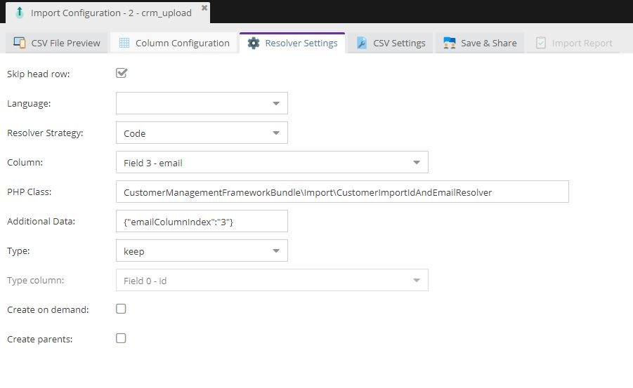
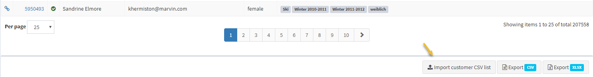
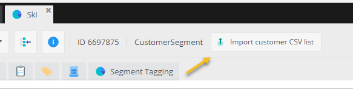

# Customer CSV importer

The CMF provides a CSV importer based on [Pimcore's standard CSV import services](https://pimcore.com/docs/5.0.x/User_Documentation/DataObjects/CSV_Import/index.html).

## Step by step guide to setup the importer:

### Step 1:
Create a saved CSV importer configuration for customers and remember its ID. [See here for more details.](https://pimcore.com/docs/5.0.x/User_Documentation/DataObjects/CSV_Import/index.html)

In the column mapping of the importer configuration the CMF adds an additional "Operator Customer Segments" for handling the import of customer segments to customers (as comma-separated ID list column in the CSV file). The "Operator Customer Segments" directly handles the correct target field (calculated or manual segments) based on whether the imported segments are manual or calculated segments. Therefore no field needs to be configured. Just add the operator and you are finished! The operator offers one option called "replace segments". If this option is checked, the segments will be replaced in the customer objects. Otherwise they will be added/merged to the existing customer segments.

When you are finished the configuration might look something like this:


There exists a resolver based on the email field. Set the emailColumnIndex for Additional Data to the column index of the email field.

Here is an example configuration:



If the checkbox 'Create on demand' is checked, new customers are created and imported, otherwise the import of new customers is rejected.

### Step 2:

In the CMF config setup the following configuration options

```yaml
pimcore_customer_management_framework:
    # Configuration of CSV customer importer
    import:
        customerImportParentId: 1 # Default customer import folder. Only relevant when automatic naming scheme is disabled.
        customerImporterId: 1     # Importer config ID for CSV imports.
```

### Step 3:

Share the importer config with users who should get access to the CSV importer. [See also](https://pimcore.com/docs/5.0.x/User_Documentation/DataObjects/CSV_Import/index.html)

### Step 4:

Try out the importer feature. When setup correctly the importer button should appear at two positions in the system:

1. in the customer list view:



2. as importer for customer segments:



Via this button the customer CSV list will be imported and afterwards the given customer segment will be added to all customers in the list.