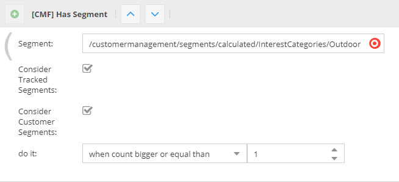
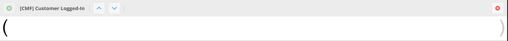
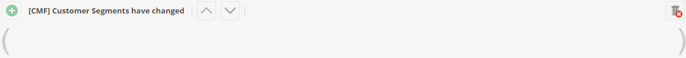
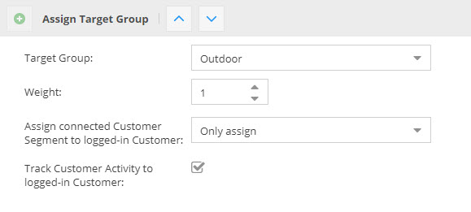
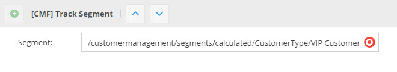
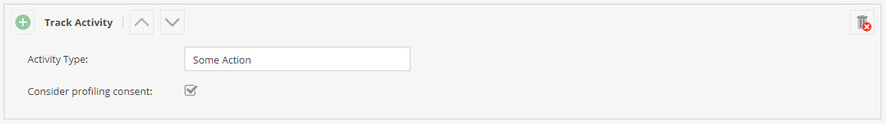
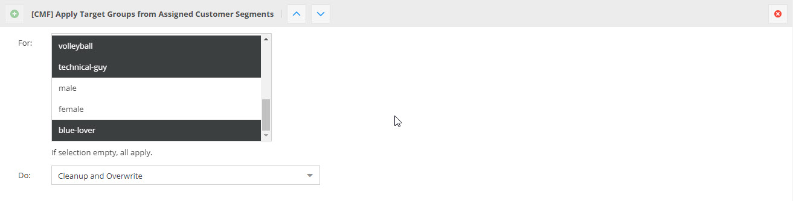

# Additional Conditions and Actions to Pimcore Global Targeting Rules

The CMF adds following conditions and action to the Pimcore Global Targeting Rules:

### Condition `[CMF] Has Segment`
This condition checks if the current user has the given segment assigned. There are two data sources supported: 
1) Targeting storage with tracked segments (see also Action `[CMF] Track Segment`). 
2) User profile with assigned segments. 

To consider these data sources use the checkboxes `Consider Tracked Segments` and `Consider Customer Segments` in the 
configuration. 
The `Has Segment` condition also checks for a certain count of segment assignments of the given segment.    

### Condition `[CMF] Customer Logged-In`
This condition checks if currently a user is logged in. There are no further config options to this condition.

### Condition `[CMF] Customer Segments have changed`
This condition checks if the segments of the currently logged-in user have changed. If no user is logged in, condition 
always returns null. There are no further config options to this condition.

### Action `Assign Target Group`
The CMF extends the default `Assign Target Group` action with following options: 

- `Assign connected Customer Segment to logged-in Customer`: If a user is logged-in, the action checks if there is 
  a segment object connected to the given target group. If so, it assigns it to the customer object.
- `Track Customer Activity to logged-in Customer`; If a user is logged-in, the action tracks an activity to the customer 
  object. This action can then used for further processing later on. 
- `Consider profiling consent`: If a user is logged-in, the action checks the `profilingConsent` attribute of the user. 
  If `profilingConsent` is not true, the action will be ignored.    

### Action `[CMF] Track Segment`
The `Track Segment` action stores the given segment to the Targeting Storage of the current user. This information can 
be used later on, e.g. with the `Has Segment` condition. 

### Action `[CMF] Track Activity`
The `Track Activity` action tracks an activity of the given `Activity Type` to the currently logged in user. 
- `Consider profiling consent`: If a user is logged-in, the action checks the `profilingConsent` attribute of the user. 
  If `profilingConsent` is not true, the action will be ignored.  
  
It does nothing if no user is logged in. 

### Action `[CMF] Apply Target Groups from Assigned Customer Segments`
The `Apply Target Groups from Assigned Customer Segments` action applies all customer segements from the currently 
logged-in customer that are linked to a target group to the targeting engine. This might be necessary for keeping information
stored in the customer object in sync with the targeting engine. Follwing options influence the behaviour: 

- `For` filters for certain target groups that should be considered. Empty selection means that all target groups are 
  considered.
- `Do` sets three apply types:
  - `Cleanup and Overwrite`: Cleans up all considered target groups from targeting storage and newly adds target groups 
    from assigned customer segments including their application counter as assignment count in targeting storage.  
  - `Cleanup and Merge`: Cleans up all considered target groups from targeting storage and newly adds target groups 
    from assigned customer segments. But: the assignment count in targeting storage is only updated when application counter of
    customer segment is higher.
  - `Only Merge`: Only merges target groups from customer segments by updating assigment count in targeting storage if higher. 
 

