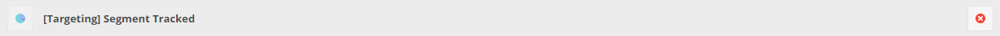
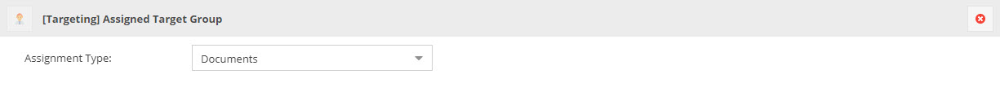
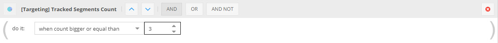
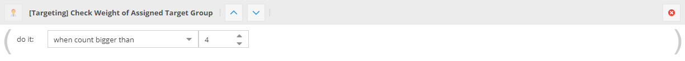
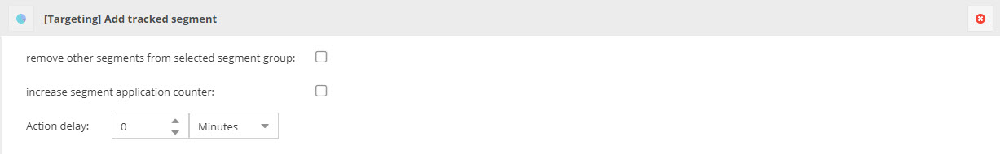
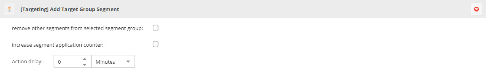

# Special Triggers, Conditions and Actions in CMF Action Trigger Service
In addition to the Pimcore Global Targeting Rules there are also additional triggers, conditions and actions for integration
of Targeting with the CMF Action Trigger Service. 

## Trigger `[Targeting] Segment Tracked`
This trigger fires every time a segment is tracked to the Targeting Store - for example by a Global Targeting Rule or 
when a document with an [assigned segment](../12_SegmentAssignment.md) is opened by an user. There are no further configuration
options, it only stores the segment for later use in conditions and actions.  

## Trigger `[Targeting] Assigned Target Group`
This trigger is fired every time a target group is assigned to the current user - either by a Global Targeting Rule or
when a document with an assigned target group is opened by an user. 

This trigger can be used to modify customer objects (e.g. assigning segments, changing values or tracking segments) when 
a target group is assigned.  

## Condition `[Targeting] Tracked Segments Count`
This condition can check how often the tracked segment is tracked in the Targeting Storage. It always uses the segment 
stored by the `Segment Tracked` trigger. 

Optionally the condition can be restricted to certain segments by adding segments to the list. 

## Condition `[Targeting] Check Weight of Assigned Target Group`
This condition can check how often the target group is assigned to the current user in the Targeting Storage (weight). 
It always uses the target group stored by the `Assigned Target Group` trigger. 

Optionally the condition can be restricted to certain target groups by selecting them in the list. 

## Action `[Targeting] Add tracked segment`
This action adds the tracked segment (stored by the `Segment Tracked` trigger) to the customer object. It can be configured
if other segments from the same group should be removed and if the segment application counter should be increased. 
Additionally it's possible to configure, if the `profilingConsent` attribute of the customer object should be considered. 

## Action `[Targeting] Add Target Group Segment`
If there is a segment assigned to the current target group (stored by the `Assigned Target Group` trigger), this action adds  
it to the customer object. It can be configured if other segments from the same group should be removed and if the 
segment application counter should be increased. 
Additionally it's possible to configure, if the `profilingConsent` attribute of the customer object should be considered. 

