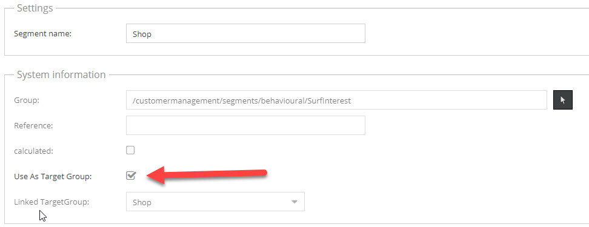
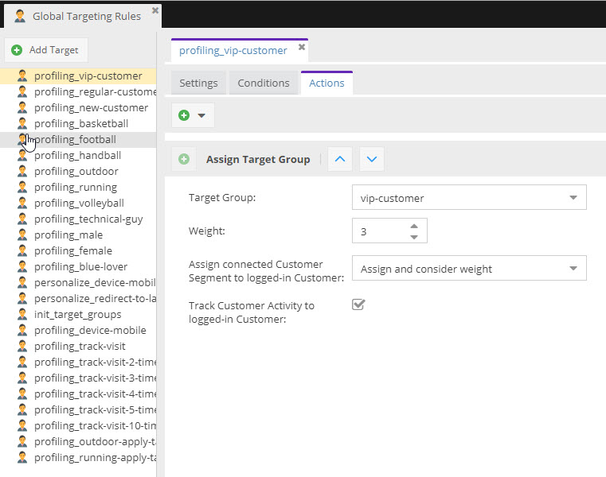
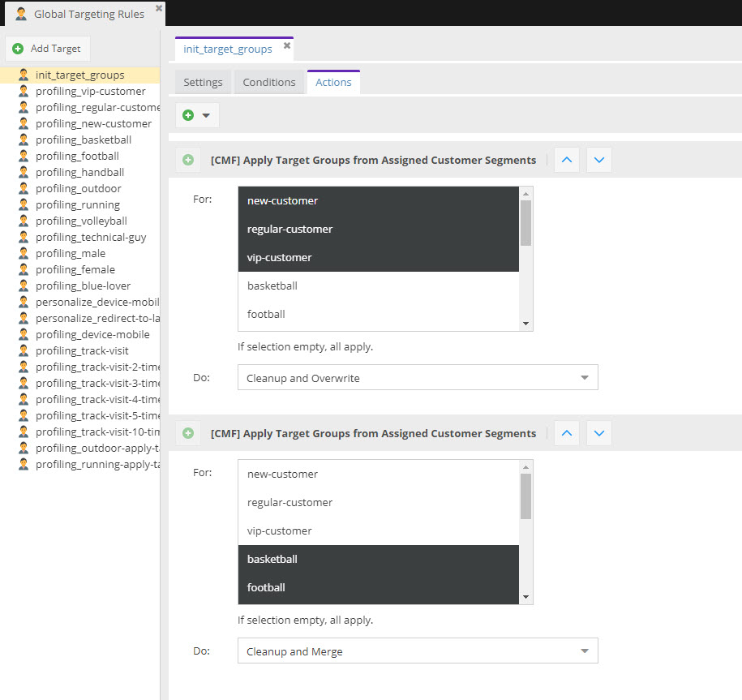
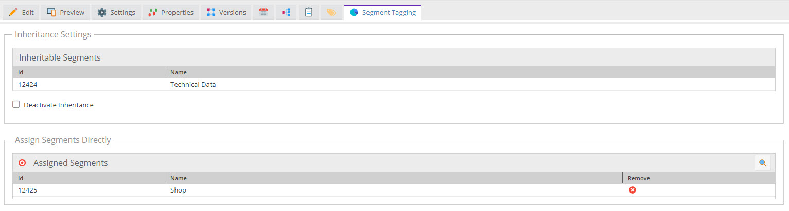
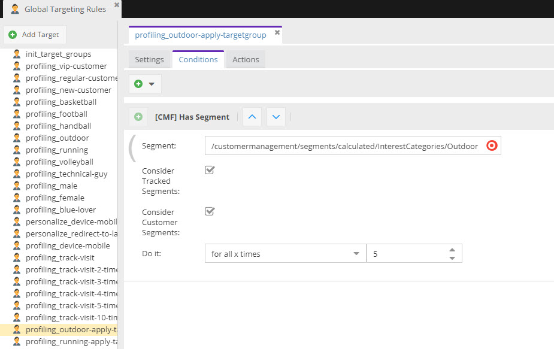
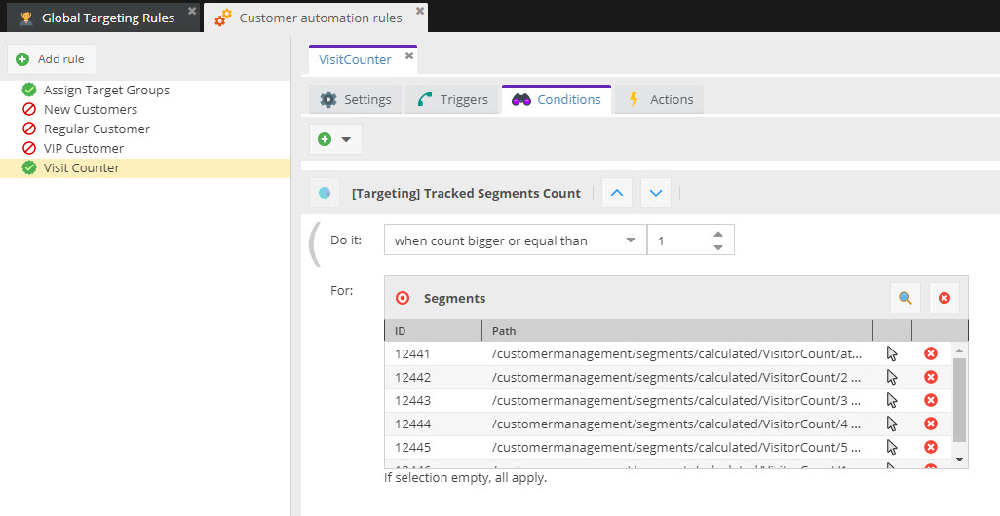

# Example Usecases

Following examples describe typical usecases for the Pimcore personalization engine in combination with the CMF.

## Use Segments 1:1 as Target Groups
The most simple usecase is to use segments 1:1 as target groups. To do so, it is important to create customer segments 
and link them to corresponding target groups by activating the checkbox `Use As Target Group` in segment objects. When 
doing so, a target group with the same name is automatically created and linked to this segment. 

 
When using targeting rules with the `Assign Target Group` action, besides assigning target group to the current visitor,
there are also options to store the connected segment to the current customer and track activities. 
 
Storing the segment to the customer is necessary to persist this information for later visits of the customer, especially
when the customer visits from a different device. 
 

 
See the targeting rules `profiling_new-customer`, `profiling_regular-customer` and `profiling_vip-customer` in our
[demo](https://demo.pimcore.fun/admin). 
 
  
For details on the configuration options also see the [details page](./01_Additional_Targeting_Role_Components.md).
 
 
## Initialize Target Groups based on Customer Object Data
  
Once the segments are stored in customer objects, the visitor storage should be preinitialised on the customers next 
visit, thus the connected target groups should be assigned as the the customers visits the next time - also on another
device. 

This can be done with initialization targeting rules, like the `init_target_groups` rule in the 
[demo](https://demo.pimcore.fun/admin). 

This action only can be executed when a customer is logged in. 
Use condition `[CMF] Customer Segments have changed` as condition and set action scope to `Session (with variables)` to 
make sure, that initialization is executed only once per session and as soon as segments of customer object have changed. 

## Use Customer Segments as more fine-grained Profiling Entity

There are situations, where customer segments are more fine-grained, where there is no 1:1 link between target groups 
and segments, and where not every time a target group is assigned also the persistence in the customer object itself should
be updated.

**Typical usecases are:** 
* It should be tracked, that a visitor opened certain pages without assigning a target group.  
* A target group and a customer segement should be assined not every time a page is visited, but for example each fifth time. 

To do so, the visitor profiling process has to be split into two steps: 
1) Tracking customer segments
2) Calculate target groups based on tracked customer segments

 
### 1) Tracking Customer Segments

Tracking customer segements means collecting customer segments based on the behavior of the visitor. E.g. when the 
customer visits certain pages that contain certain information, corresponding customer segements can be tracked.  
The collected customer segments are stored per customer and can be used later on for further calculations or personalizations.    

**There are two ways for tracking customer segments:** 

1) **Tracking Segments when visiting Pimcore documents**
With the [Segment Assignment](../12_SegmentAssignment.md) feature, segements can be assigned to documents. 

Once segments are assigned, they are tracked automatically when a visitor opens the document page. 

For samples see the pages like 
[/en/More-Stuff/Landingpages/Chevrolet](https://demo.pimcore.fun/en/More-Stuff/Landingpages/Chevrolet)
[/en/More-Stuff/Landingpages/Ford-Musclecars](https://demo.pimcore.fun/en/More-Stuff/Landingpages/Ford-Musclecars)
in our demo. 

2) **Tracking Segments with targeting rules**
Also with targeting rules segments can be tracked - e.g. instead of assigning target groups. Just use the 
`[CMF] Track Segment` action. 
 
 
As example see the rule `profiling_sports-car-fan` in our [demo](https://demo.pimcore.fun/admin). 

### 2) Calculate Target Groups based on Tracked Customer Segmentts

Once segments are tracked, they can be used for calculating target groups. For example, a target group should be assigned 
every fifth time when a segment is tracked. To do so, a targeting rule with `[CMF] Has Segment` condition and 
`Assign Target Group` is necessary.

For details on the configuration options also see the [details page](./01_Additional_Targeting_Role_Components.md).
 
See the rule `profiling_sports-car-fan_apply-targetgroup` in our 
[demo](https://demo.pimcore.fun/admin).

## Apply Tracked Segments to Customer objects

The last use case is to save tracked segments to the customer object without assigning any target groups to the visitor. 
This is especially useful when extracting relevant behavior information out of the visitors behavior and saving it to the
customer object for later segmentation and personalization. 

To do so, create an [CMF Action Trigger](../22_ActionTrigger.md) rule with `[Targeting] Segment Tracked` as trigger, 
a `[Targeting] Tracked Segments Count` condition and a `[Targeting] Add tracked segment` action. 

As example see the `Visit Counter` rule in our [demo](https://demo.pimcore.fun/admin).

