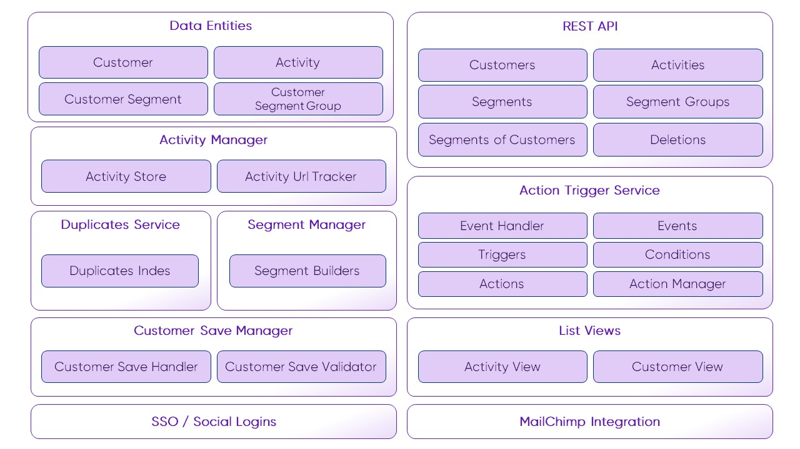

# Architecture Overview

The following architecture overview shows available framework components. The component configuration takes place in the 
`pimcore_customer_management_framework` configuration node. Optionally for each component a custom implementation can be 
configured and used.

For Details for the components see additional documentation pages like: 

* Data Entities for [Customer](./Working-with-Customers.md) and [Customer Segments](./CustomerSegments.md)
* [Activity Manager](./Activities.md)
* [Customer Duplicates Service](./CustomerDuplicatesService.md)
* [Segment Manager](./CustomerSegments.md)
* [Customer Save Manager](./CustomerSaveManager.md)
* [Rest API Webservice](./Webservice.md)
* [Action Trigger Service](./ActionTrigger.md)
* [List Views](./ListViews.md)
* [SSO and Social Logins](./Single_Sign_On.md)
* [MailChimp Integration](./NewsletterSync.md)
